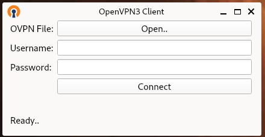

OpenVPN3-QT 
============
A simple OpenVPN3 Client written in Python3 & QT.

## OpenVPN 3
First and foremost, please download and install OpenVPN 3 from here:  
https://community.openvpn.net/openvpn/wiki/OpenVPN3Linux

Quick command line overview - connect to a vpn:
```shell
openvpn3 session-start --config /home/user/Documents/example.ovpn
```

To check if you are connected:
```shell
openvpn3 sessions-list
```

To disconnect:
```shell
openvpn3 session-manage --path "/net/openvpn/v3/sessions/UUID_FROM_SESSIONS_LIST" --disconnect
```

## OpenVPN 3 - QT Client

Once you know that openvpn3 is working, give this QT client a go!  

To install copy and paste the following commands in a terminal:
```shell
curl -s "https://raw.githubusercontent.com/guy-keller/openvpn3-qt/1.3.1/install.sh" | bash
```

After running the commands above you are good to go.  
Press the 'super' key, and look for the OpenVPN3 shortcut.

Supports: Debian, Ubuntu, Fedora and RHEL    
Desktop Environment: Gnome

### Screenshots

Shortcut:    


UI - Fields:  


UI - Connect:  


UI - Connected:  


### Uninstalling / Removing OpenVPN3 - QT Client

Paste the following in a terminal:
```shell
sudo rm -rf /opt/openvpn3-qt/
sudo rm -rf /usr/share/applications/openvpn3-qt.desktop
```

### Disclaimer

THIS CODE IS PROVIDED AS IS WITHOUT WARRANTY OF ANY KIND, EITHER EXPRESS OR IMPLIED, INCLUDING ANY IMPLIED WARRANTIES OF FITNESS FOR A PARTICULAR PURPOSE, MERCHANTABILITY, OR NON-INFRINGEMENT.
ALL RIGHTS RESERVED TO THE COMPANIES/TRADEMARKS MENTIONED.

